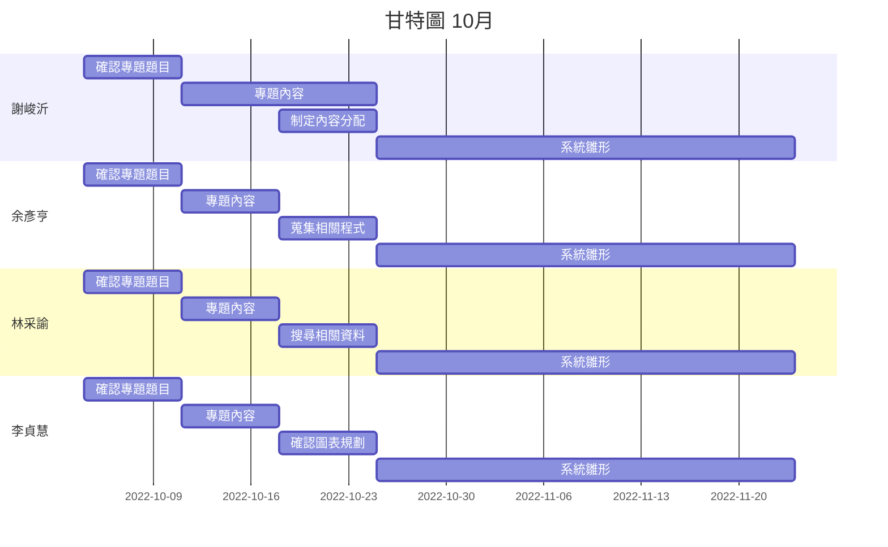

# Group_14

---

# SystemAnalysis-group14

---

| 職位 | 學號 | 姓名 | 任務 |
| :---: | :---: | :---: | :---: |
| **組長** | C109118251 | [謝峻沂](https://github.com/Jimmy1016/nkust_SA-D_111-1/blob/main/README.md) | 任務規劃與分配 |
| 組員 | C109118208 | [余彥亨](https://github.com/yuyan2123/NKUST-111-1-SA-D/blob/main/README.md) | 程式碼編輯 |
| 組員 | C109118240 | [林采諭](https://github.com/C109118240/C109118240/blob/main/README.md) | 進行甘特圖繪製 |
| 組員 | C109118253 | [李貞慧](https://github.com/C109118253/C109118253/blob/main/README.md) | 進行PERT/CPM圖表繪製 |

---

**動機**：提升學校圖書館網頁效能

由於學校圖書館系統使用時時常會延遲，且操作不便。

隨著科技的進步，資料處理的速度與網際網路的速度越來越快，人們等待網頁的耐心越來越少，根據研究顯示，如果網頁載入的時間超過三秒以上，將有一半的使用者離開。
還有網頁的相容性，在人手一機的時代，手機已經是大多人的生產力工具，如果相容性不好會造成不佳的體驗。
現在的圖書館系統對於上述兩點還有進步空間，所以才做出來改善現在這套系統。

預期效益：學校圖書相關系統整合並提升視覺效果，以達到使用者操作便利、借閱時不卡頓、節省時間。

---
## 甘特圖

---
## PERT

---

