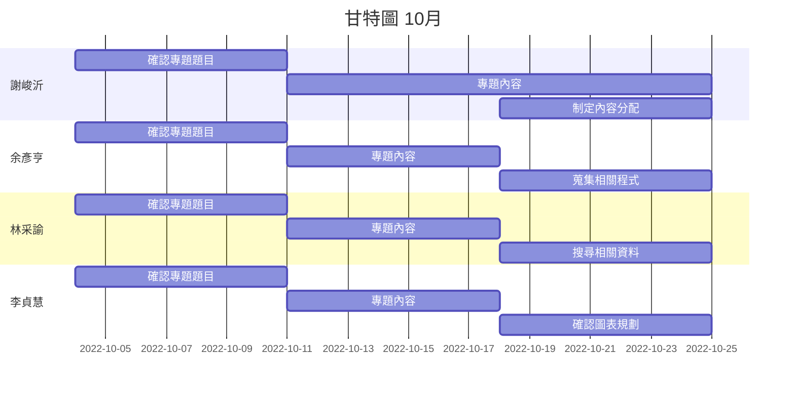

# Group_14

---

# SystemAnalysis-group14

---

| 職位 | 學號 | 姓名 | 任務 |
| :---: | :---: | :---: | :---: |
| **組長** | C109118251 | [謝峻沂](https://github.com/Jimmy1016/nkust_SA-D_111-1/blob/main/README.md) | 任務規劃與分配 |
| 組員 | C109118208 | [余彥亨](https://github.com/yuyan2123/NKUST-111-1-SA-D/blob/main/README.md) | 程式碼編輯 |
| 組員 | C109118240 | [林采諭](https://github.com/C109118240/C109118240/blob/main/README.md) | 進行甘特圖繪製 |
| 組員 | C109118253 | [李貞慧](https://github.com/C109118253/C109118253/blob/main/README.md) | 進行PERT/CPM圖表繪製 |

---
## 甘特圖

---
## PERT

---
