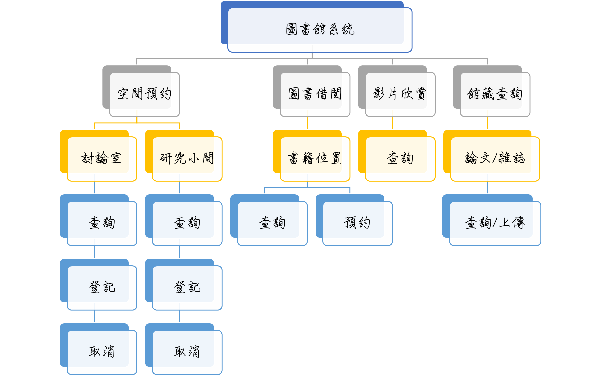
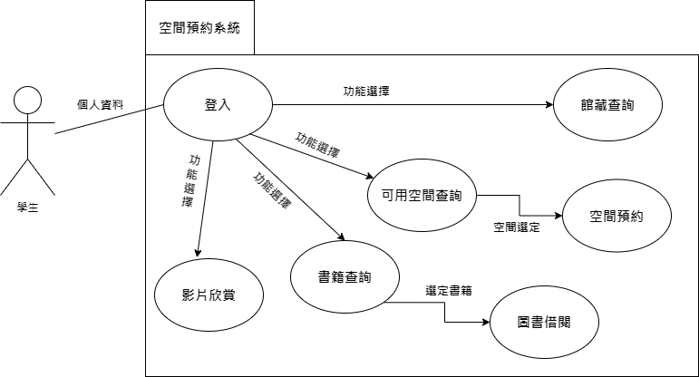

## 功能性需求
1. 預約個人研究小間、討論室、發表室  
2. 查詢、修改及取消  
3. 圖書館借書系統做整合  

## 非功能性需求
1. 反應時間短，進行借閱時不會出現卡頓  
2. 使用性高，進行預約的時間不會超過五分鐘  
3. 可靠度高，進行借閱時不會衝突  
---

## FDD

---
## 需求分析
1. 使用者藉由查詢尋找書籍  
2. 使用者藉由查詢無討論室或研究小間  
3. 進行預約或借閱進行書籍或討論室的使用    
4. 查詢位於別的校區的書籍  
5. 論文的查詢及上傳   

---
## 使用案例圖
  

---

### 使用案例說明一  
|**使用案例名稱**|**空間預約**|
|:--------------|:----------|
|**行動者**|學生|
|**說明**|查詢空閒空間後進行預約|
|**完成動作**|1.選定欲借閱空間及時間 2.輸入借用者資訊 3.發送借閱資料至資料庫 4.回傳成功通知|
|**替代方法**|1.選定欲借閱空間及時間 2.輸入借用者資訊 3.發送借閱資料至資料庫 4.回傳已被借用|
|**先決條件**|選定有效空間/時間、完整輸入借用者資訊|
|**後置條件**|資料成功加入資料庫，發送email通知|
|**假設**|無|

---
### 使用案例說明二  
|**使用案例名稱**|**圖書借閱**|
|:--------------|:----------|
|**行動者**|學生|
|**說明**|選定想要的書籍線上預約借閱|
|**完成動作**|1.選定書籍 2.輸入取書地點及時間 3.送出申請 4.回傳借閱成功通知並發送email|
|**替代方法**|1.選定書籍 2.輸入取書地點及時間 3.送出申請 4.回傳借閱失敗通知|
|**先決條件**|書籍沒被借閱、至少選擇一本書、為本校教職員/學生/校友、未積欠逾期歸還費用|
|**後置條件**|借閱資訊成功加入資料庫，發送email通知|
|**假設**|無|

---
### 使用案例說明三  
|**使用案例名稱**|**館藏查詢**|
|:--------------|:----------|
|**行動者**|學生|
|**說明**|供查詢本校五校區館藏書籍、雜誌及論文|
|**完成動作**|1.輸入書籍名稱 2.顯示該本書籍資訊及相似推薦|
|**替代方法**|1.輸入書籍名稱 2.顯示查無此書|
|**先決條件**|圖書館已收藏的書籍|
|**後置條件**|查詢結束，使用者可以繼續查詢書籍|
|**假設**|無|

---

